# QA-Flow

> AI 기반 코드 품질 자동화 CLI 툴

**개발할 줄 아는 QA 엔지니어**를 목표로 제작한 프로젝트입니다.
PR이 올라오면 자동으로 AI 코드 리뷰와 컨벤션 체크를 수행하고, 결과를 PR 코멘트와 대시보드로 시각화합니다.

## 링크

- **대시보드**: https://qa-flow-zeta.vercel.app/
- **PyPI**: https://pypi.org/project/qa-flow/
- **GitHub**: https://github.com/Siuuugil/Qa-Flow

---

## 프로젝트 배경

졸업 프로젝트(Q-Match) 팀 개발 중 겪은 실제 불편함에서 시작했습니다.

- 팀원마다 코딩 컨벤션이 달라 코드 파악에 많은 시간 소요
- PR 리뷰 없이 GitHub 네트워크 그래프로 직접 코드를 확인해야 하는 비효율
- 코드가 전체 구조에서 어떤 역할을 하는지 파악하기 어려움

이 불편함을 해결하기 위해 **AI가 자동으로 코드를 분석하고 PR에 리뷰를 달아주는 툴**을 개발했습니다.

---

## 주요 기능

### CLI 자동화
```bash
qa-flow init                                     # 초기 설정 (AI Provider, API 키)
qa-flow scan --mode ai-only                      # AI 코드 리뷰
qa-flow scan --mode full --report                # 컨벤션 체크 + AI 리뷰 + 리포트 저장
qa-flow scan --file UserService.java --focus bug # 특정 파일 버그 분석
qa-flow chat                                     # AI와 자유 대화
```

### Focus 옵션 (9가지 분석 관점)
| 옵션 | 설명 |
|------|------|
| `structure` | 코드 구조 및 의존관계 분석 |
| `convention` | 네이밍 규칙 및 코드 스타일 |
| `security` | 보안 취약점 및 위험 요소 |
| `bug` | 버그 및 예외처리 누락 |
| `qa` | QA 관점의 테스트 가능성 |
| `dev` | 개발자 관점의 코드 품질 |
| `performance` | 성능 문제 및 최적화 |
| `test` | 테스트 케이스 제안 |
| `general` | 종합 리뷰 (기본값) |

### GitHub Actions CI/CD
- PR 올라오면 자동으로 `qa-flow scan` 실행
- ESLint / Flake8 컨벤션 체크 자동화
- AI 코드 리뷰 결과를 PR 코멘트로 자동 게시
- 중복 코멘트 방지 (기존 코멘트 업데이트 방식)

### 멀티 AI Provider
- **Claude** (Anthropic) / **Gemini** (Google) 선택 가능
- `--provider` 옵션으로 실시간 전환

### 대시보드
- Supabase에 분석 결과 자동 저장
- Next.js 대시보드에서 리포트 목록 / 필터 / 검색 / 상세 조회

---

## 기술 스택

| 구분 | 기술 |
|------|------|
| CLI | Python, Click, Rich |
| AI | Claude API, Gemini API |
| 자동화 | GitHub Actions |
| 컨벤션 체크 | ESLint, Flake8 |
| 대시보드 | Next.js 15, Tailwind CSS |
| DB | Supabase (PostgreSQL) |
| 배포 | Vercel, PyPI |

---

## 설치 및 사용법

### 설치
```bash
pip install qa-flow
```

### 1단계: 초기 설정

```bash
qa-flow init
```

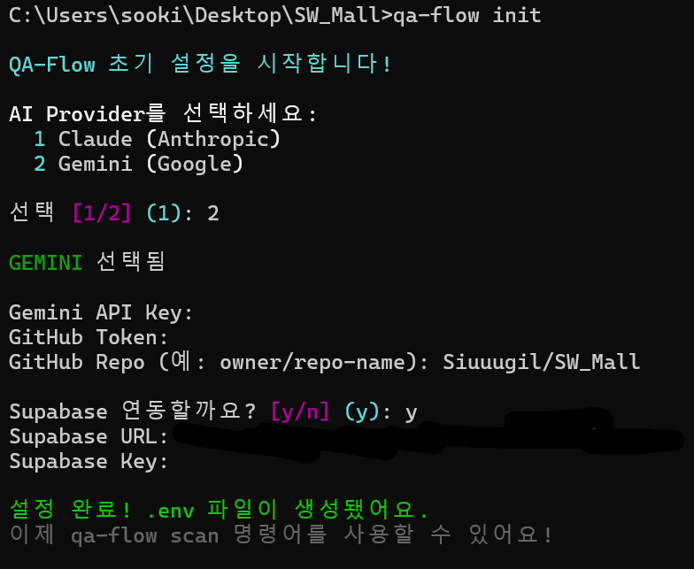

- AI Provider 선택 (Claude / Gemini)
- API 키 입력
- GitHub Token 및 레포 입력
- Supabase 연동 여부 선택

---

### 2단계: GitHub Actions 설정

**GitHub Secrets 등록**

레포지토리 → Settings → Secrets and variables → Actions

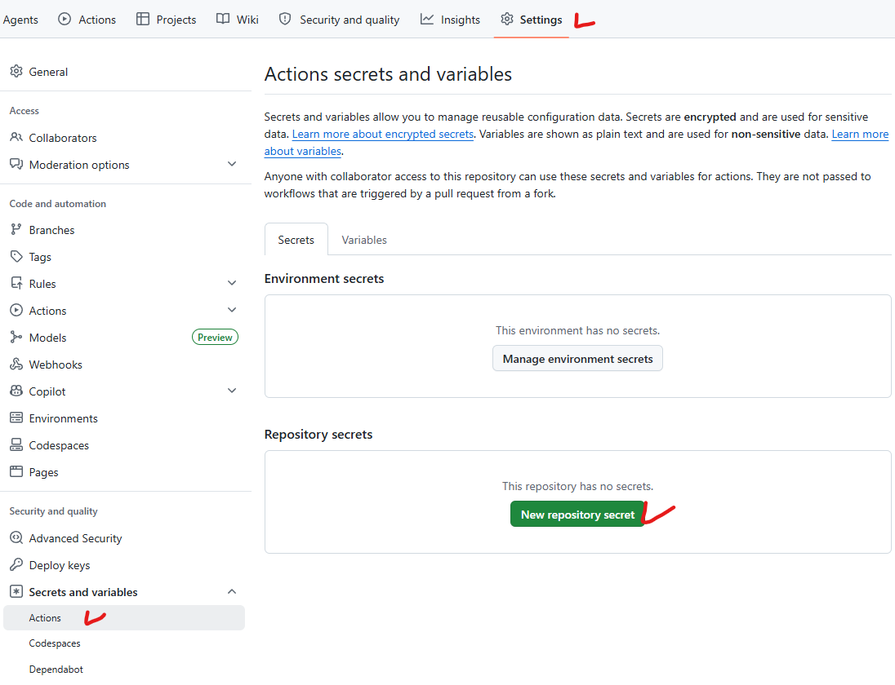

New repository secret 클릭

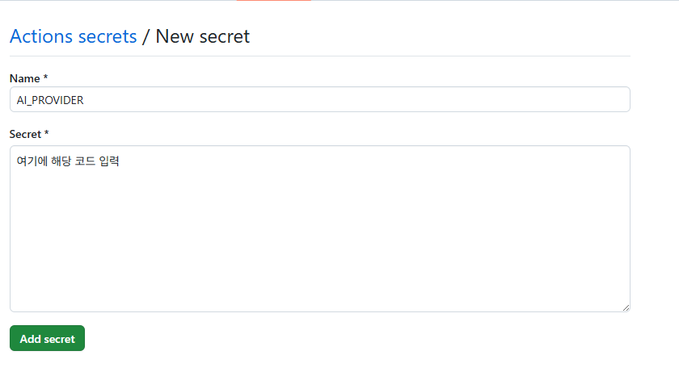

아래 5가지 Secret 등록 후 완료

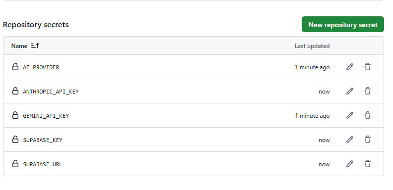

```
AI_PROVIDER       # claude 또는 gemini
GEMINI_API_KEY    # Gemini API 키
ANTHROPIC_API_KEY # Claude API 키
SUPABASE_URL      # Supabase 프로젝트 URL
SUPABASE_KEY      # Supabase API 키
```

**qa.yml 파일 추가**

이 레포의 `.github/workflows/qa.yml` 파일을 본인 레포에 복사하세요.

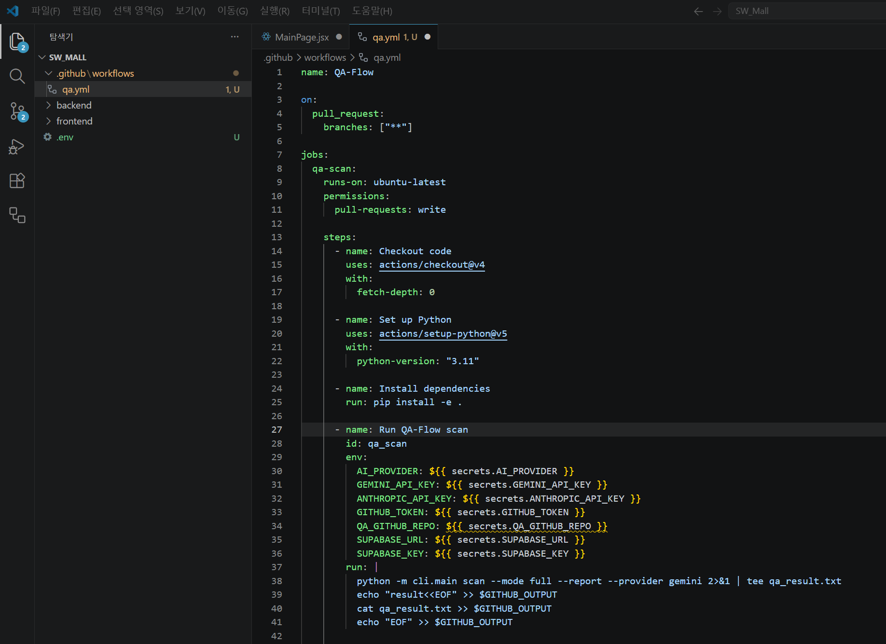

---

## 사용 예시

### 로컬에서 특정 파일 분석

```bash
qa-flow scan --file UserController.java --mode full --report
```

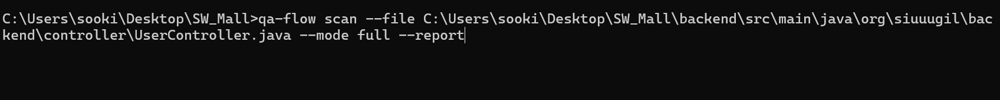

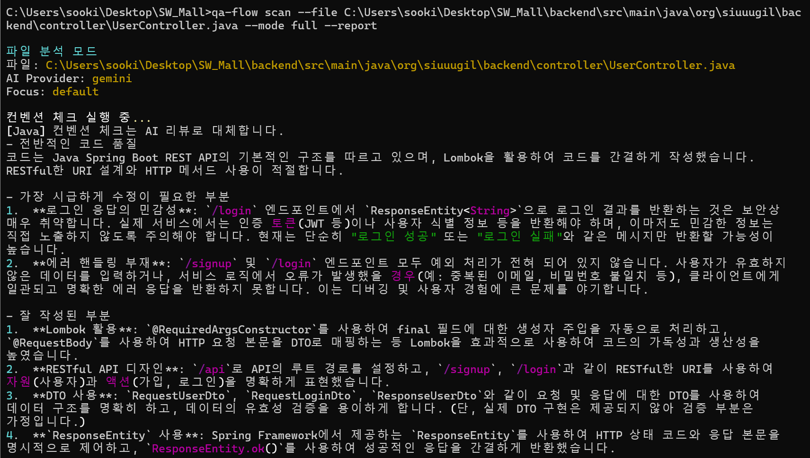

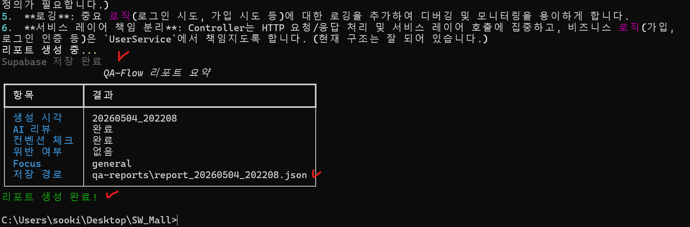

### Supabase DB 저장 확인

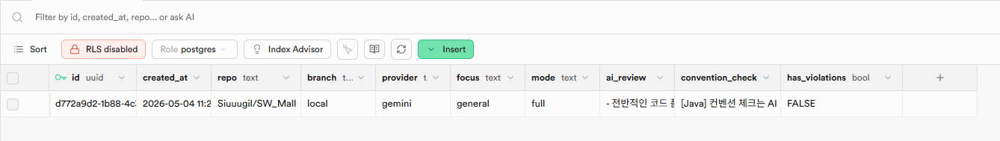

### 대시보드 확인

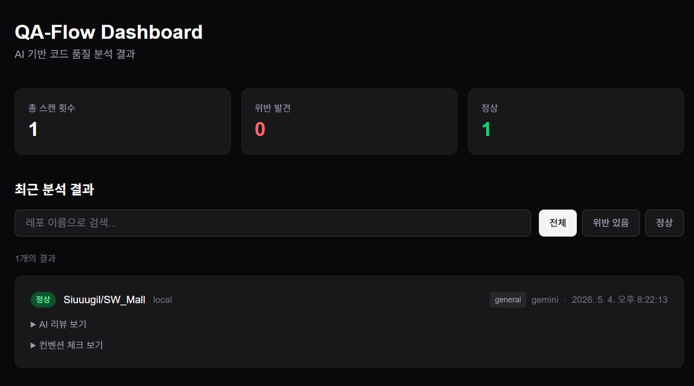

### 로컬 리포트 JSON 파일

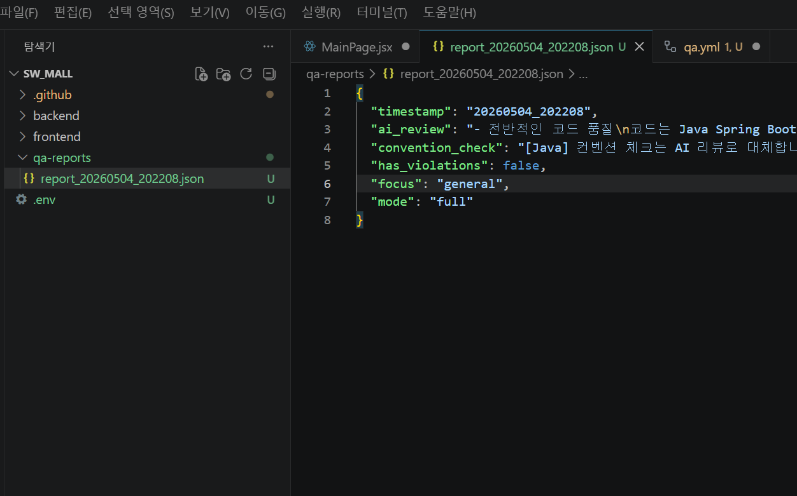

---

## 프로젝트 구조

```
Qa-Flow/
├── cli/
│   ├── commands/
│   │   ├── init.py       # qa-flow init
│   │   ├── scan.py       # qa-flow scan
│   │   └── chat.py       # qa-flow chat
│   ├── core/
│   │   ├── ai_review.py  # AI 리뷰 엔진
│   │   ├── convention.py # 컨벤션 체크
│   │   ├── reporter.py   # 리포트 생성 및 Supabase 저장
│   │   └── providers/
│   │       ├── claude.py # Claude API
│   │       └── gemini.py # Gemini API
│   └── main.py
├── dashboard/             # Next.js 대시보드
│   ├── app/
│   │   ├── page.tsx
│   │   ├── components/
│   │   └── reports/[id]/
│   └── lib/
│       └── supabase.ts
├── assets/                # README 이미지
└── .github/
    └── workflows/
        └── qa.yml         # GitHub Actions
```

---

## 추후 계획

- Jira 연동 (버그 발견 시 자동 이슈 생성)
- 품질 점수 도입
- 트렌드 차트 
- Focus별 분포도 파이 차트
- 폴더 전체 분석 

---

## 개발자 정보

**김수길** |

- GitHub: [@Siuuugil](https://github.com/Siuuugil)
- e-mail: tnrlftmdi@gmail.com
- 연락 주시면 언제든지 답변 드리겠습니다.